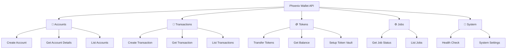

# API Reference Overview

Phoenix Wallet API provides a comprehensive REST API for managing custodial wallets on Flow blockchain. This section covers all available endpoints, request/response formats, and usage examples.

## 🌐 **Base URL**

```
http://localhost:3000/v1
```

## 🔐 **Authentication**

Phoenix Wallet API supports multiple authentication methods:

### **API Key Authentication (Recommended)**
```http
GET /v1/accounts
Authorization: Bearer your-api-key-here
```

### **No Authentication (Development)**
For development and testing, authentication can be disabled:
```http
GET /v1/accounts
```

## 📋 **Common Headers**

### **Required Headers**
```http
Content-Type: application/json
```

### **Idempotency (POST Requests)**
```http
Idempotency-Key: 550e8400-e29b-41d4-a716-446655440000
```

### **Optional Headers**
```http
Accept: application/json
User-Agent: YourApp/1.0
```

## 🔄 **Request/Response Format**

### **Request Format**
All requests use JSON format:
```json
{
  "field1": "value1",
  "field2": "value2"
}
```

### **Response Format**
All responses follow a consistent structure:

#### **Success Response**
```json
{
  "data": {
    // Response data here
  },
  "status": "success"
}
```

#### **Error Response**
```json
{
  "error": {
    "code": "INVALID_REQUEST",
    "message": "Detailed error message",
    "details": {
      // Additional error context
    }
  },
  "status": "error"
}
```

## 📊 **HTTP Status Codes**

| Status Code | Meaning | Description |
|-------------|---------|-------------|
| `200` | OK | Request successful |
| `201` | Created | Resource created successfully |
| `400` | Bad Request | Invalid request format or parameters |
| `401` | Unauthorized | Authentication required |
| `403` | Forbidden | Insufficient permissions |
| `404` | Not Found | Resource not found |
| `409` | Conflict | Idempotency key is already pending |
| `422` | Unprocessable Entity | Valid request but business logic error |
| `429` | Too Many Requests | Rate limit exceeded |
| `500` | Internal Server Error | Server error |
| `503` | Service Unavailable | Service temporarily unavailable |

## 🏗️ **API Structure**

### **Core Resources**



## 🔗 **Resource Relationships**

### **Account → Transactions**
```http
GET /v1/accounts/{address}/transactions
```

### **Account → Token Balances**
```http
GET /v1/accounts/{address}/fungible-tokens
GET /v1/accounts/{address}/non-fungible-tokens
```

### **Account → Token Operations**
```http
POST /v1/accounts/{address}/fungible-tokens/{token}/withdrawals
GET /v1/accounts/{address}/fungible-tokens/{token}/deposits
```

## 📝 **Common Patterns**

### **Pagination**
```http
GET /v1/accounts?limit=20&offset=0
```

**Response:**
```json
{
  "data": [...],
  "pagination": {
    "limit": 20,
    "offset": 0,
    "total": 150,
    "hasMore": true
  }
}
```

### **Filtering**
```http
GET /v1/transactions?status=completed&from=2024-01-01
```

### **Sorting**
```http
GET /v1/accounts?sort=created_at&order=desc
```

## 🔄 **Asynchronous Operations**

Many operations in Phoenix Wallet API are asynchronous and return a job:

### **Job Creation**
```http
POST /v1/accounts/{address}/fungible-tokens/FlowToken/withdrawals
```

**Response:**
```json
{
  "job": {
    "id": "job_123456789",
    "type": "token_withdrawal",
    "status": "pending",
    "createdAt": "2024-01-15T10:30:00Z"
  },
  "transaction": {
    "id": "tx_987654321",
    "status": "pending"
  }
}
```

### **Job Status Checking**
```http
GET /v1/jobs/{jobId}
```

**Response:**
```json
{
  "id": "job_123456789",
  "type": "token_withdrawal",
  "status": "completed",
  "result": {
    "transactionId": "abc123def456...",
    "blockHeight": 12345
  },
  "createdAt": "2024-01-15T10:30:00Z",
  "completedAt": "2024-01-15T10:30:15Z"
}
```

## 🛡️ **Security Considerations**

### **Rate Limiting**
```http
HTTP/1.1 429 Too Many Requests
X-RateLimit-Limit: 100
X-RateLimit-Remaining: 0
X-RateLimit-Reset: 1642248000
```

### **Idempotency**
```http
POST /v1/accounts/{address}/fungible-tokens/FlowToken/withdrawals
Idempotency-Key: unique-operation-id

# Duplicate completed request returns the original response again.
# A duplicate while the first request is still pending returns:
HTTP/1.1 409 Conflict
```

### **Input Validation**
```json
{
  "error": {
    "code": "VALIDATION_ERROR",
    "message": "Invalid input parameters",
    "details": {
      "amount": "Must be a positive number",
      "recipient": "Must be a valid Flow address"
    }
  }
}
```

## 📚 **API Sections**

### **[Accounts API](./accounts)**
- Create and manage Flow accounts
- Handle account keys and metadata
- Account balance queries

### **[Transactions API](./transactions)**
- Execute transactions on Flow
- Query transaction status and history
- Sign and submit raw transactions

### **[Tokens API](./tokens)**
- Transfer fungible and non-fungible tokens
- Setup token vaults
- Track deposits and withdrawals

### **[System API](./system)**
- Health checks and status
- System configuration
- Maintenance mode

## 🧪 **Testing the API**

### **Using cURL**
```bash
# Create account
curl -X POST http://localhost:3000/v1/accounts \
  -H "Content-Type: application/json" \
  -d '{}'

# Get account details
curl http://localhost:3000/v1/accounts/0x1234567890abcdef
```

### **Using Interactive Documentation**
Visit http://localhost:8080 to access the interactive documentation where you can:
- Browse all endpoints
- Test API calls directly
- View request/response examples
- Understand data schemas

### **Using Postman**
Import the OpenAPI specification from:
```
http://localhost:3000/v1/openapi.json
```

## 🔍 **Error Handling**

### **Common Error Codes**

| Code | Description | Solution |
|------|-------------|----------|
| `ACCOUNT_NOT_FOUND` | Account doesn't exist | Verify account address |
| `INSUFFICIENT_BALANCE` | Not enough tokens | Check account balance |
| `INVALID_TRANSACTION` | Transaction validation failed | Review transaction parameters |
| `NETWORK_ERROR` | Flow network issue | Retry after delay |
| `KEY_MANAGEMENT_ERROR` | Key operation failed | Check key configuration |

### **Error Response Example**
```json
{
  "error": {
    "code": "INSUFFICIENT_BALANCE",
    "message": "Account has insufficient balance for this operation",
    "details": {
      "required": "100.0",
      "available": "50.0",
      "token": "FlowToken"
    }
  },
  "status": "error",
  "timestamp": "2024-01-15T10:30:00Z",
  "requestId": "req_123456789"
}
```

## 🚀 **Next Steps**

- **[Accounts API](./accounts)** - Learn about account management
- **[Tokens API](./tokens)** - Explore token operations
- **[Integration Examples](../examples/basic-usage)** - See real-world usage patterns

Ready to explore the API? Start with the [Accounts API](./accounts) documentation!
