# Account Management

Account management is at the core of Phoenix Wallet API, providing secure custodial wallet functionality for Flow blockchain applications. This section explains how accounts work, their lifecycle, and security considerations.

## 🔑 **What are Flow Accounts?**

In Flow blockchain, accounts are fundamental entities that:
- **Hold assets** (FLOW tokens, other fungible tokens, NFTs)
- **Execute transactions** through cryptographic signatures
- **Store smart contract code** and data
- **Have unique addresses** for identification

Phoenix Wallet API manages these accounts in a **custodial manner**, meaning the API holds and manages the private keys on behalf of your application.

## 🏗️ **Account Architecture**

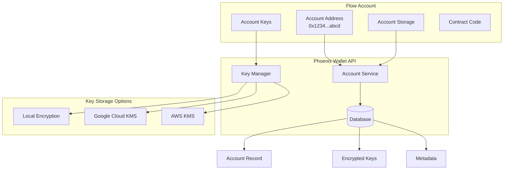

## 📋 **Account Lifecycle**

### **1. Account Creation**

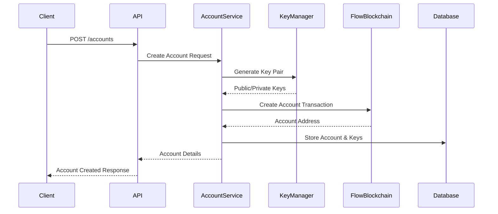

**Process Steps:**
1. **Key Generation**: Create cryptographic key pair
2. **Key Encryption**: Encrypt private key for storage
3. **Blockchain Transaction**: Submit account creation to Flow
4. **Address Assignment**: Flow assigns unique address
5. **Database Storage**: Store account metadata and encrypted keys

### **2. Account Usage**

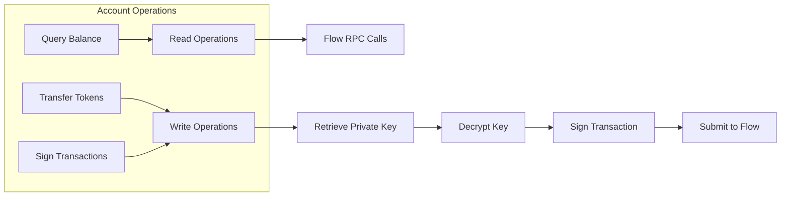

### **3. Account Monitoring**

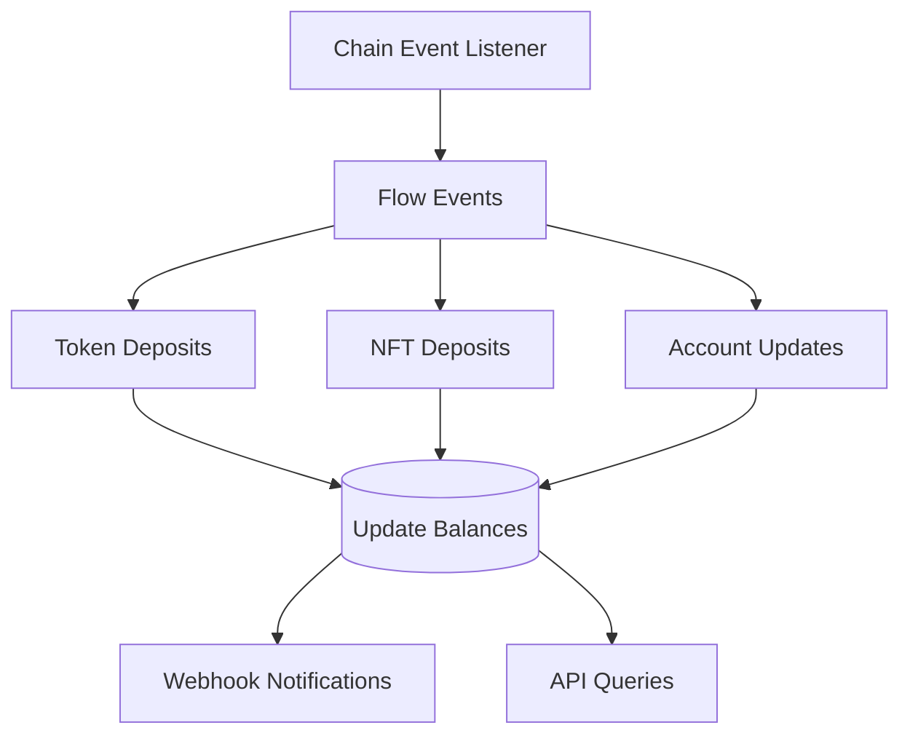

## 🔐 **Key Management**

### **Key Types and Security**

Phoenix Wallet API supports multiple key management strategies:

#### **Local Key Storage**
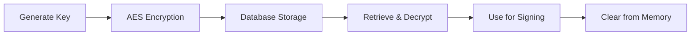

**Characteristics:**
- Keys encrypted with AES-256
- Encryption key configurable
- Suitable for development and testing
- Lower security for production

#### **Google Cloud KMS**
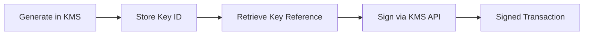

**Characteristics:**
- Hardware Security Module (HSM) backed
- Keys never leave Google's infrastructure
- Audit logging and access controls
- Enterprise-grade security

#### **AWS KMS**
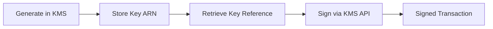

**Characteristics:**
- FIPS 140-2 Level 2 validated HSMs
- Fine-grained IAM permissions
- CloudTrail integration
- Multi-region availability

### **Key Rotation and Recovery**

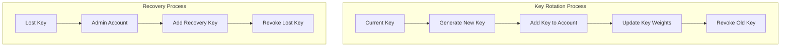

## 👥 **Account Types**

### **Custodial Accounts**
Accounts fully managed by Phoenix Wallet API:

```json
{
  "address": "0x1234567890abcdef",
  "type": "custodial",
  "keys": [
    {
      "index": 0,
      "publicKey": "04a1b2c3...",
      "weight": 1000,
      "signAlgo": "ECDSA_P256",
      "hashAlgo": "SHA3_256"
    }
  ],
  "balance": "100.50000000"
}
```

**Features:**
- Full key management by API
- Transaction signing capability
- Balance tracking
- Token vault management

### **Watch-Only Accounts**
Accounts monitored but not controlled:

```json
{
  "address": "0xabcdef1234567890",
  "type": "watch_only",
  "keys": [],
  "balance": "250.75000000"
}
```

**Features:**
- Balance monitoring
- Transaction history
- Deposit detection
- No signing capability

## 🔄 **Multi-Key Support**

Flow accounts can have multiple keys for enhanced security and throughput:

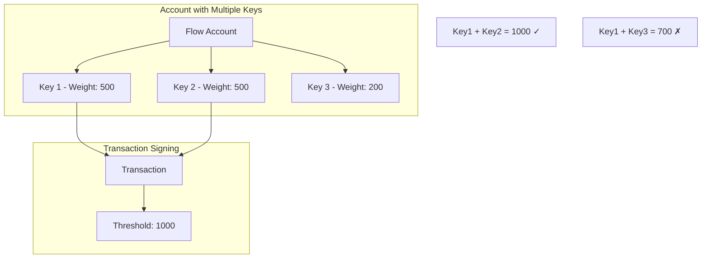

**Benefits:**
- **Parallel Processing**: Multiple keys enable concurrent transactions
- **Security**: Threshold signatures for critical operations
- **Redundancy**: Backup keys for recovery scenarios

## 📊 **Account States and Status**

### **Account Status Flow**

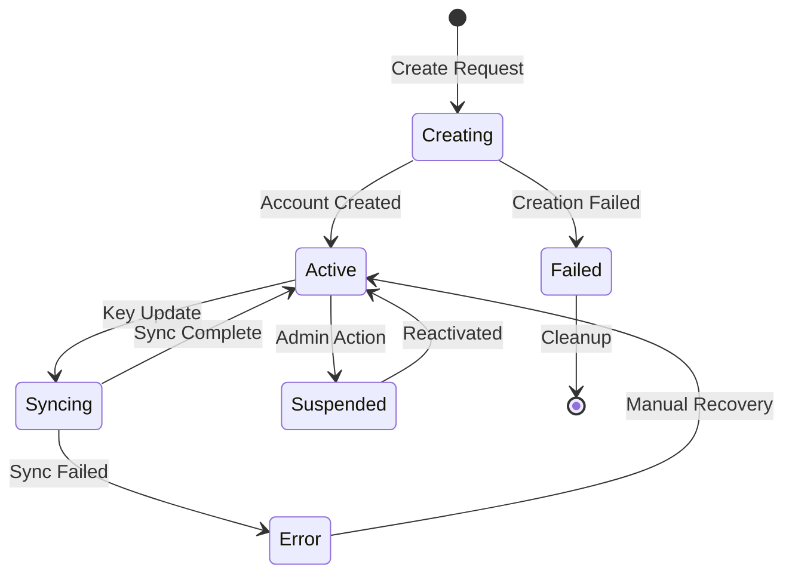

### **Status Descriptions**

| Status | Description | Operations Allowed |
|--------|-------------|-------------------|
| `creating` | Account creation in progress | None |
| `active` | Account ready for operations | All operations |
| `syncing` | Key synchronization in progress | Read-only |
| `suspended` | Temporarily disabled | Read-only |
| `error` | Requires manual intervention | None |
| `failed` | Creation failed | None |

## 🛡️ **Security Best Practices**

### **Production Recommendations**

1. **Use Hardware Security Modules**
   ```bash
   # Configure Google KMS
   FLOW_WALLET_DEFAULT_KEY_TYPE=google_kms
   FLOW_WALLET_GOOGLE_KMS_PROJECT_ID=your-project
   ```

2. **Enable Key Rotation**
   ```bash
   # Regular key rotation schedule
   FLOW_WALLET_KEY_ROTATION_INTERVAL=30d
   ```

3. **Monitor Account Activity**
   ```bash
   # Enable comprehensive logging
   FLOW_WALLET_LOG_LEVEL=info
   FLOW_WALLET_AUDIT_LOGGING=true
   ```

4. **Implement Access Controls**
   ```bash
   # API key authentication
   FLOW_WALLET_API_KEY_REQUIRED=true
   FLOW_WALLET_RATE_LIMITING=true
   ```

### **Development vs Production**

| Aspect | Development | Production |
|--------|-------------|------------|
| **Key Storage** | Local encryption | KMS (Google/AWS) |
| **Database** | SQLite | PostgreSQL |
| **Monitoring** | Basic logging | Full observability |
| **Backup** | Optional | Required |
| **Access Control** | Relaxed | Strict |

## 🔍 **Account Monitoring and Analytics**

### **Real-time Monitoring**

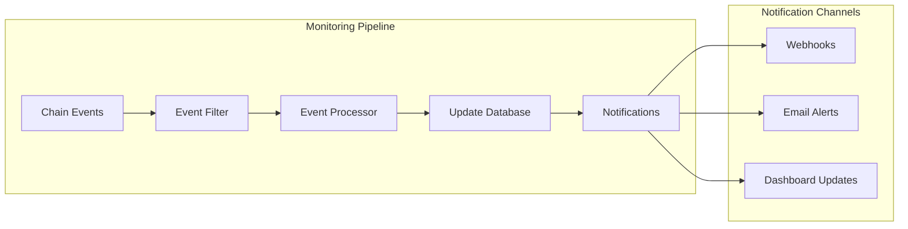

### **Analytics and Reporting**

- **Balance Tracking**: Historical balance changes
- **Transaction Volume**: Daily/monthly transaction counts
- **Token Distribution**: Asset allocation across accounts
- **Performance Metrics**: Transaction success rates and latency

Account management in Phoenix Wallet API provides a robust foundation for building secure, scalable custodial wallet solutions on Flow blockchain.