# Architecture Overview

Phoenix Wallet API is built with a modular, service-oriented architecture that provides scalability, maintainability, and flexibility for custodial wallet management on Flow blockchain.

## 🏗️ **High-Level Architecture**

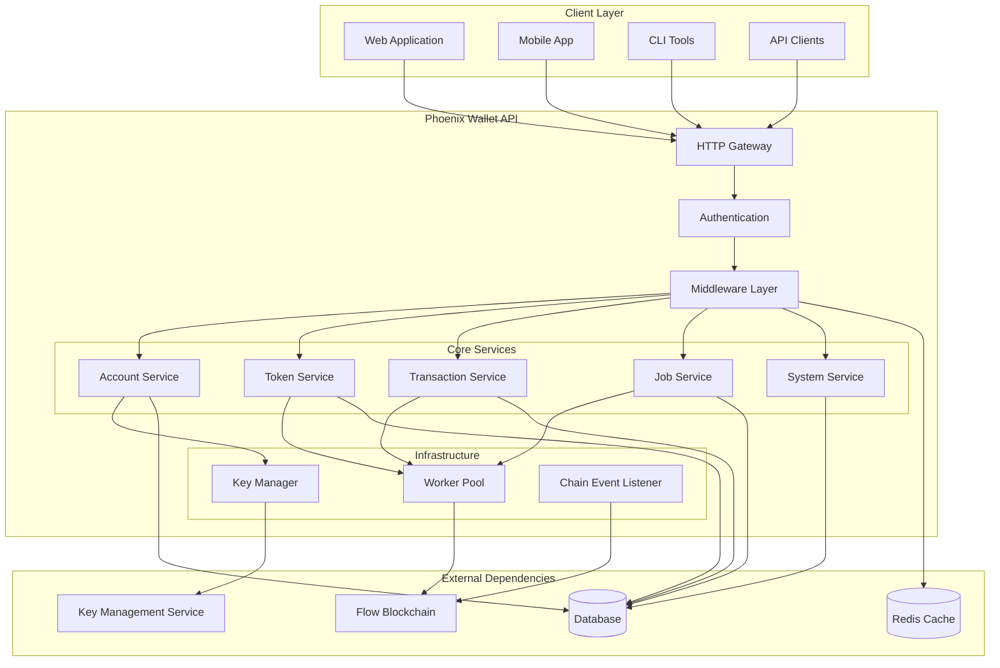

## 🔧 **Core Components**

### **HTTP Gateway Layer**
The entry point for all API requests, handling:
- **Request Routing**: Directs requests to appropriate services
- **Authentication**: Validates API keys and permissions
- **Rate Limiting**: Prevents abuse and ensures fair usage
- **CORS Handling**: Enables cross-origin requests for web applications

### **Middleware Layer**
Provides cross-cutting concerns:
- **Logging**: Comprehensive request/response logging
- **Compression**: Reduces bandwidth usage
- **Idempotency**: Prevents duplicate operations
- **Error Handling**: Standardized error responses

### **Service Layer**
Business logic organized into focused services:

#### **Account Service**
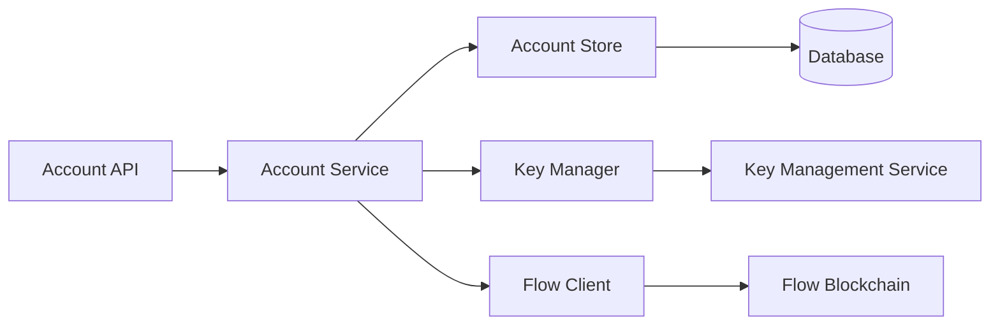

**Responsibilities:**
- Create and manage Flow accounts
- Handle account key operations
- Manage account metadata and state

#### **Transaction Service**
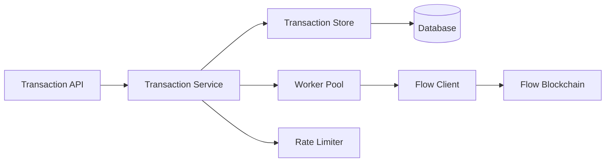

**Responsibilities:**
- Execute transactions on Flow blockchain
- Manage transaction lifecycle and status
- Handle transaction signing and submission
- Provide transaction history and details

#### **Token Service**
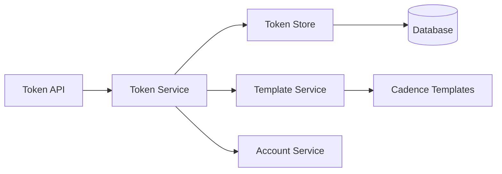

**Responsibilities:**
- Manage fungible and non-fungible tokens
- Handle token transfers and deposits
- Track token balances and metadata
- Support custom token implementations

#### **Job Service**
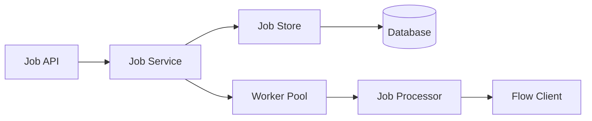

**Responsibilities:**
- Manage asynchronous operations
- Queue and process background jobs
- Provide job status and progress tracking
- Handle job retries and error recovery

## 🔄 **Data Flow Architecture**

### **Synchronous Operations**
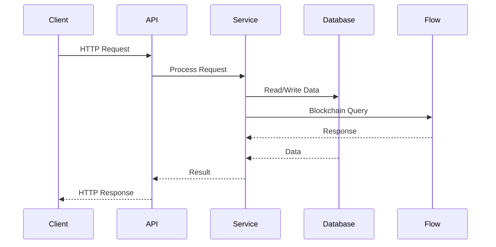

### **Asynchronous Operations**
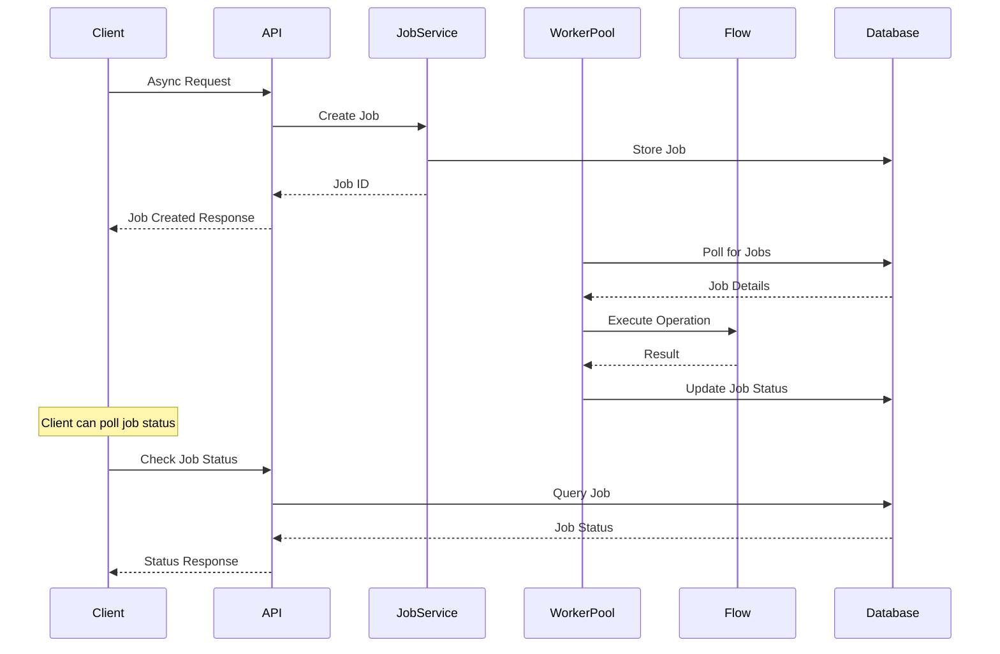

## 🗄️ **Data Architecture**

### **Database Schema Overview**
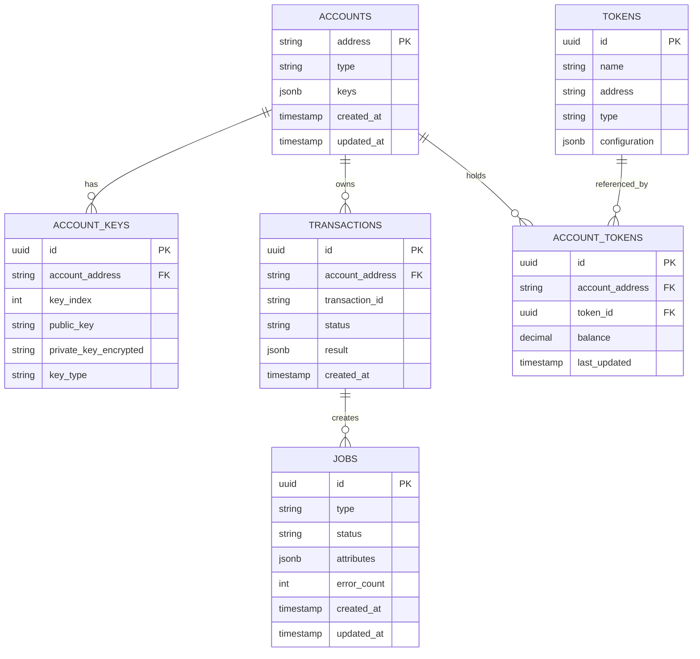

## 🔐 **Security Architecture**

### **Key Management Flow**
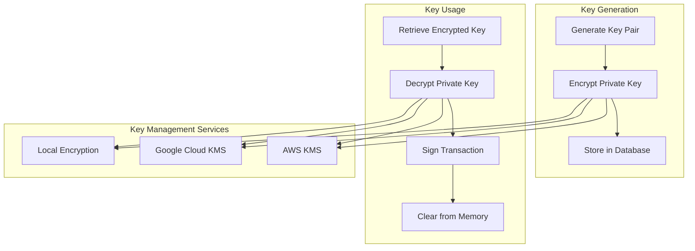

### **Authentication & Authorization**
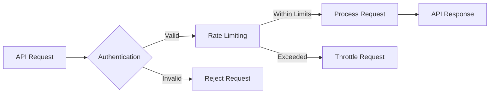

## 🚀 **Deployment Architectures**

### **Lightweight Mode**
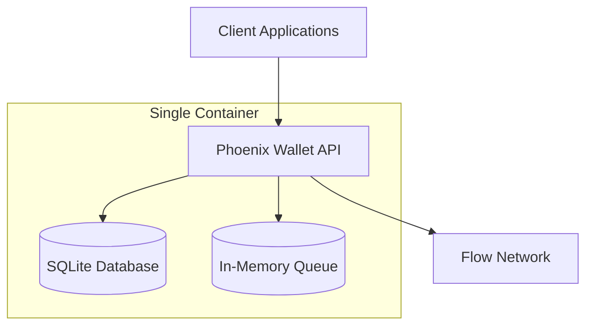

**Characteristics:**
- Single container deployment
- SQLite for data persistence
- In-memory job processing
- Perfect for development and small-scale production

### **Standard Mode**
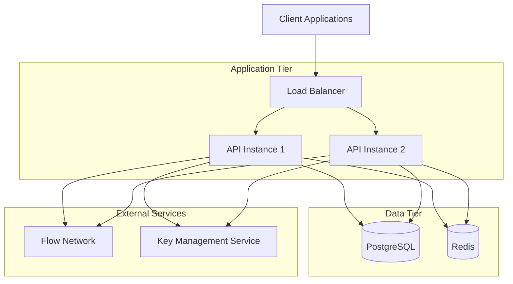

**Characteristics:**
- Horizontally scalable
- Shared PostgreSQL database
- Redis for caching and job queues
- Production-ready with high availability

## 📊 **Performance Considerations**

### **Scalability Patterns**
- **Horizontal Scaling**: Multiple API instances behind load balancer
- **Database Optimization**: Connection pooling and query optimization
- **Caching Strategy**: Redis for frequently accessed data
- **Rate Limiting**: Prevent abuse and ensure fair resource usage

### **Monitoring & Observability**
- **Health Checks**: Liveness and readiness probes
- **Metrics Collection**: Performance and usage metrics
- **Logging**: Structured logging for debugging and audit
- **Error Tracking**: Comprehensive error reporting and alerting

This architecture provides a solid foundation for building scalable, secure, and maintainable custodial wallet solutions on Flow blockchain.