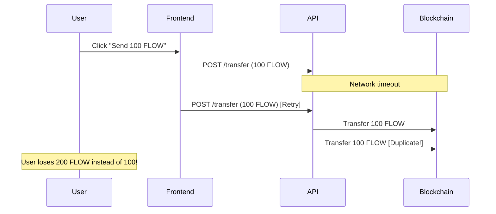
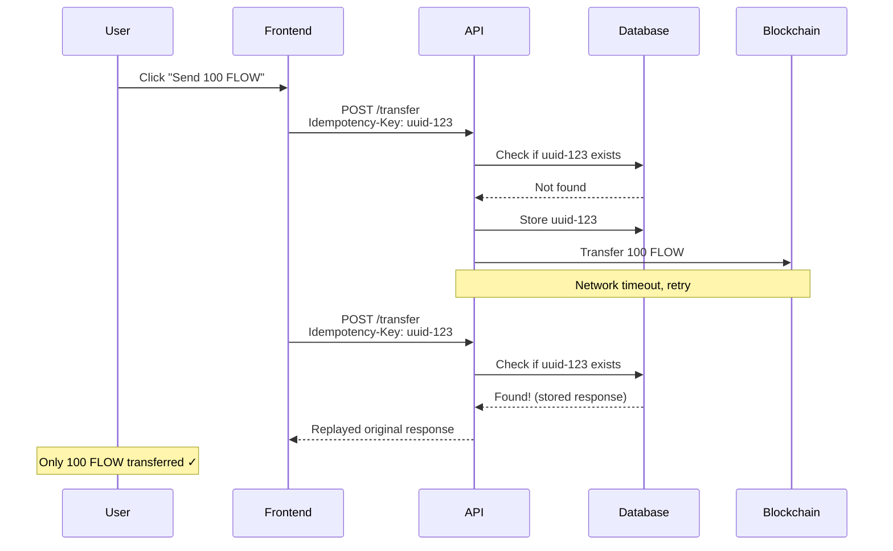
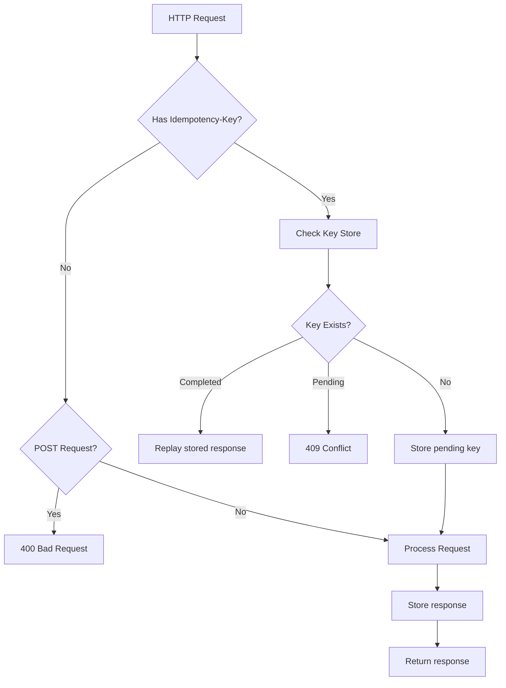
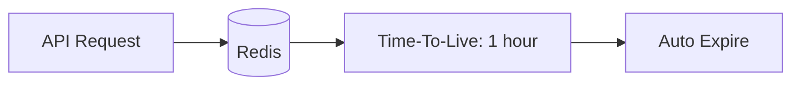
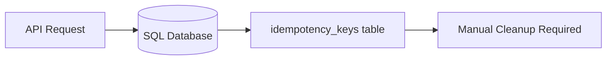
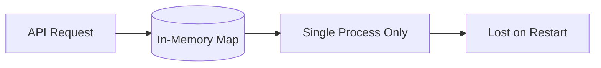
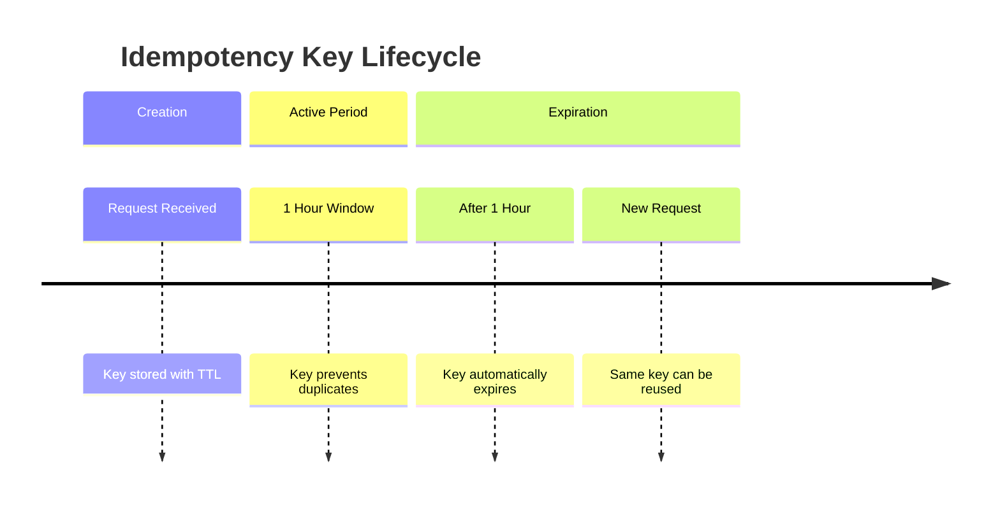
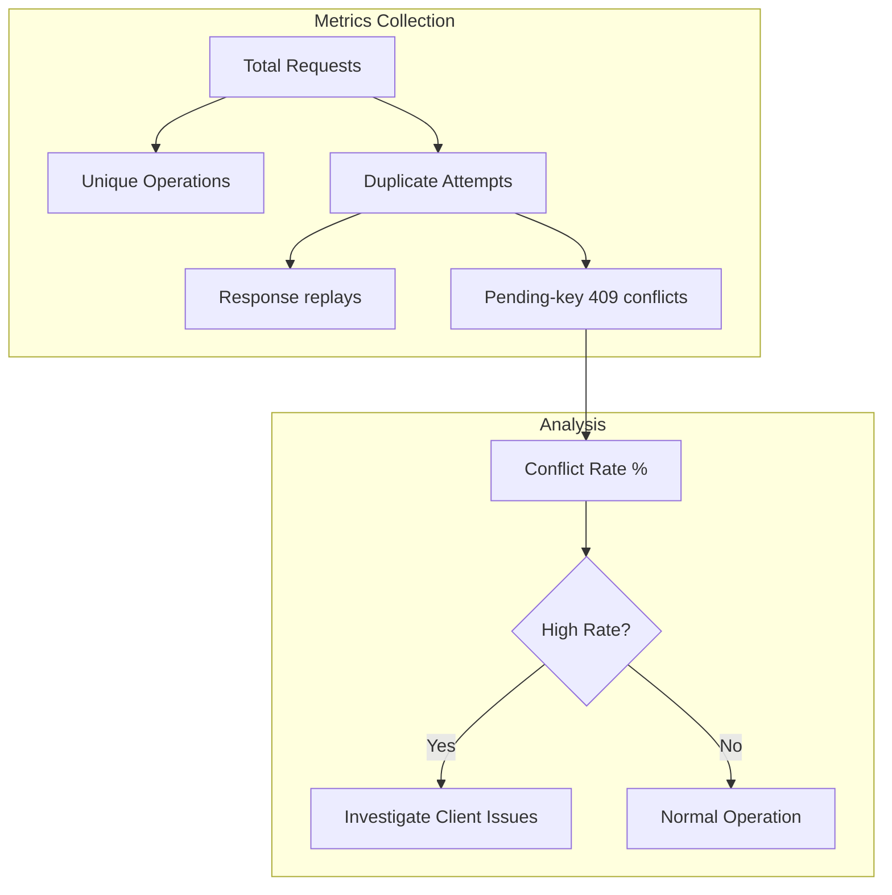

# Idempotency

Idempotency is a critical concept in Phoenix Wallet API that ensures the same operation can be performed multiple times without causing unintended side effects. This is especially important for financial operations where duplicate transactions could result in loss of funds.

## 🔄 **What is Idempotency?**

**Idempotency** means that performing the same operation multiple times produces the same result as performing it once. In the context of Phoenix Wallet API, this prevents:

- **Duplicate transactions** from network retries
- **Double spending** from user interface issues  
- **Race conditions** in concurrent systems
- **Accidental repeated operations** from client errors

## 🎯 **Why Idempotency Matters**

### **The Problem Without Idempotency**



### **The Solution With Idempotency**



## 🛠️ **How Idempotency Works**

### **Idempotency Key Flow**



### **Storage Mechanisms**

Phoenix Wallet API supports multiple storage backends for idempotency keys:

#### **Redis Storage (Production)**


**Characteristics:**
- High performance in-memory storage
- Automatic key expiration
- Supports distributed deployments
- Recommended for production

#### **Database Storage (Shared)**


**Characteristics:**
- Uses same database as application
- Persistent storage
- Requires manual cleanup
- Good for single-instance deployments

#### **In-Memory Storage (Development)**


**Characteristics:**
- Fastest access time
- No external dependencies
- Not suitable for production
- Perfect for development and testing

## ⚙️ **Configuration Options**

### **Standard Mode Configuration**

```bash
# Enable idempotency (default: false)
FLOW_WALLET_DISABLE_IDEMPOTENCY_MIDDLEWARE=false

# Storage type: redis, shared, local
FLOW_WALLET_IDEMPOTENCY_MIDDLEWARE_DATABASE_TYPE=redis

# Redis connection (if using redis)
FLOW_WALLET_IDEMPOTENCY_MIDDLEWARE_REDIS_URL=redis://localhost:6379/
```

### **Lightweight Mode Configuration**

```bash
# Enable lightweight mode
FLOW_WALLET_LIGHTWEIGHT_MODE=true

# Optional: Enable idempotency in lightweight mode
FLOW_WALLET_LIGHTWEIGHT_IDEMPOTENCY=true
```

When `FLOW_WALLET_LIGHTWEIGHT_IDEMPOTENCY=true`:
- Automatically uses SQLite database for key storage
- No Redis dependency required
- Keys persist across container restarts
- Perfect for production deployments without Redis

## 🔧 **Implementation Details**

### **Idempotency Key Requirements**

```http
POST /v1/accounts/0x123.../fungible-tokens/FlowToken/withdrawals
Content-Type: application/json
Idempotency-Key: 550e8400-e29b-41d4-a716-446655440000

{
  "recipient": "0x456...",
  "amount": "100.0"
}
```

**Key Requirements:**
- **Unique**: Each operation must have a unique key
- **UUID Format**: Recommended to use UUID v4
- **Client Generated**: Client is responsible for generating keys
- **Consistent**: Same operation should use same key for retries

### **Response Behavior**

| Scenario | HTTP Status | Response |
|----------|-------------|----------|
| First request with key | `200/201/4xx` | Normal response, stored as completed |
| First request that returned `5xx` | `5xx` | Reservation released; safe to retry with the same key |
| Duplicate completed key | Original status | Original response body replayed (handler not re-run) |
| Duplicate pending key | `409 Conflict` | "Idempotency-Key conflict" |
| Missing key (POST) | `400 Bad Request` | "Idempotency-Key header not found" |
| GET/DELETE requests | `200` | Key not required |

**Retrying with the same `Idempotency-Key`:**

- After a successful response (`2xx`) or a business-side error (`4xx`) the
  original response is replayed exactly as stored, and the downstream handler
  is **not** executed again. Re-using a key that already produced a `4xx`
  keeps returning that same `4xx` payload.
- After a transient failure (`5xx`) the reservation is released. A retry with
  the same key executes the downstream handler again from scratch, so the
  client can recover instead of looping forever on a stored error.

### **Known Residual Risk**

If persisting a successful response to the idempotency store fails even after
the in-process retries (transient store outage at the same time as a side
effect already happened on the downstream, e.g. a Flow transaction was
submitted), the client receives the real response but the key is **not**
marked completed. A retry with the same `Idempotency-Key` will then run the
handler again and may produce a duplicate side effect. This window is bounded
by the in-process retry loop and is logged at `error` level for operators, but
it is not closed by a two-phase commit.

### **Key Expiration**



**Default Expiration**: 1 hour
- Balances security with usability
- Prevents indefinite key accumulation
- Allows eventual key reuse

## 🌐 **Network-Specific Behavior**

### **Deployment Modes Comparison**

| Mode | Idempotency | Storage | Persistence | Use Case |
|------|-------------|---------|-------------|----------|
| **Standard** | ✅ Redis | Redis | ✅ | Production |
| **Lightweight** | ❌ Default | - | - | Development |
| **Lightweight + Idempotent** | ✅ SQLite | SQLite | ✅ | Simple Production |

### **Network Commands**

```bash
# Local development (no idempotency)
make lightweight

# Local development (with idempotency)
make lightweight-idempotent

# Testnet (no idempotency)
make lightweight-testnet

# Testnet (with idempotency)
make lightweight-testnet-idempotent

# Mainnet (with idempotency - recommended!)
make lightweight-mainnet-idempotent
```

## 💡 **Best Practices**

### **Client Implementation**

```javascript
// Good: Generate unique key per operation
const idempotencyKey = crypto.randomUUID();

const response = await fetch('/v1/accounts/0x123.../withdrawals', {
  method: 'POST',
  headers: {
    'Content-Type': 'application/json',
    'Idempotency-Key': idempotencyKey
  },
  body: JSON.stringify({
    recipient: '0x456...',
    amount: '100.0'
  })
});

// A completed retry returns the original response again.
// A 409 means another request with this key is still pending.
```

### **Key Generation Strategies**

#### **UUID v4 (Recommended)**
```javascript
const key = crypto.randomUUID();
// Example: 550e8400-e29b-41d4-a716-446655440000
```

#### **Timestamp + Random**
```javascript
const key = `${Date.now()}-${Math.random().toString(36)}`;
// Example: 1640995200000-k2j3h4g5f6
```

#### **Operation-Based**
```javascript
const key = `transfer-${fromAccount}-${toAccount}-${amount}-${timestamp}`;
// Example: transfer-0x123-0x456-100.0-1640995200000
```

### **Error Handling**

```javascript
async function safeTransfer(transferData) {
  const idempotencyKey = crypto.randomUUID();
  
  try {
    const response = await apiCall(transferData, idempotencyKey);
    return response;
  } catch (error) {
    if (error.status === 409) {
      // Same key is already in flight. Wait briefly before retrying.
      await new Promise((resolve) => setTimeout(resolve, 1000));
      return await apiCall(transferData, idempotencyKey);
    }
    
    if (error.status >= 500) {
      // Server error - the reservation is released, retry re-runs the handler.
      return await apiCall(transferData, idempotencyKey);
    }

    // Client error - don't retry, the same 4xx will be replayed.
    throw error;
  }
}
```

## 🔍 **Monitoring and Debugging**

### **Idempotency Metrics**



### **Common Issues and Solutions**

| Issue | Symptom | Solution |
|-------|---------|----------|
| **High conflict rate** | Many pending-key 409 responses | Check concurrent client retry logic |
| **Missing keys** | 400 Bad Request | Ensure client sends keys |
| **Key reuse** | Unexpected conflicts | Generate truly unique keys |
| **Storage full** | Performance issues | Configure key expiration |

## 🚀 **Production Recommendations**

### **For High-Volume Applications**

1. **Use Redis Storage**
   ```bash
   FLOW_WALLET_IDEMPOTENCY_MIDDLEWARE_DATABASE_TYPE=redis
   FLOW_WALLET_IDEMPOTENCY_MIDDLEWARE_REDIS_URL=redis://redis-cluster:6379/
   ```

2. **Monitor Key Usage**
   ```bash
   # Enable detailed logging
   FLOW_WALLET_LOG_LEVEL=info
   ```

3. **Configure Appropriate TTL**
   ```go
   // Adjust expiration based on your use case
   IdempotencyHandlerOptions{
     Expiry: 2 * time.Hour, // Longer for critical operations
   }
   ```

### **For Simple Deployments**

1. **Use Lightweight Mode with Idempotency**
   ```bash
   make lightweight-idempotent
   ```

2. **Monitor SQLite Performance**
   ```bash
   # Check database size and performance
   ls -la data/wallet.db
   ```

Idempotency in Phoenix Wallet API provides essential protection against duplicate operations, ensuring the reliability and safety of your custodial wallet operations.
