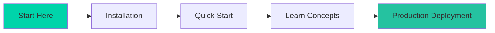
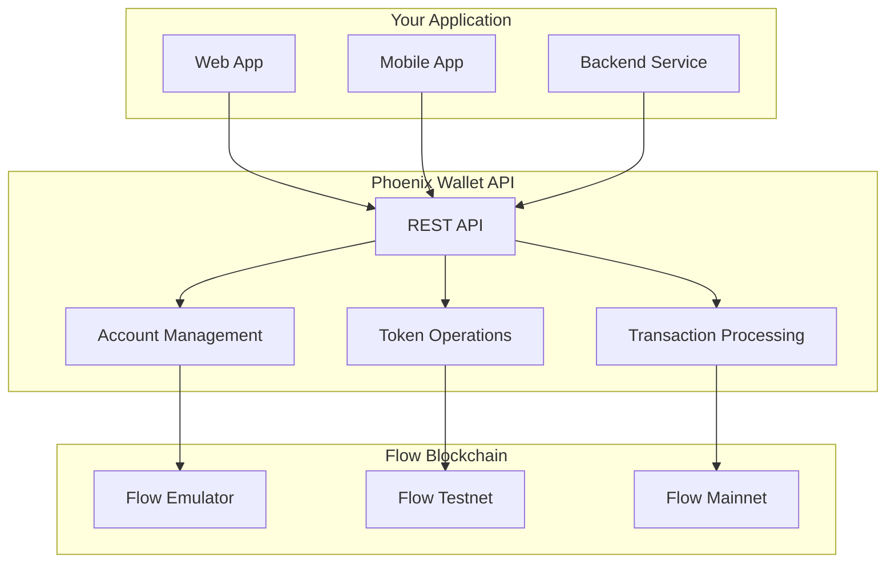

# Getting Started Overview

Welcome to Phoenix Wallet API! This guide will help you understand what Phoenix Wallet API is, why you need it, and how to get started building custodial wallet solutions on Flow blockchain.

## 🎯 **What You'll Learn**

By the end of this getting started guide, you'll understand:
- How to set up Phoenix Wallet API in different environments
- Core concepts and architecture
- How to perform basic operations like creating accounts and transferring tokens
- Best practices for production deployment

## 🚀 **Quick Start Path**



### **5-Minute Quick Start**

1. **Clone and Start**
   ```bash
   git clone https://github.com/flow-hydraulics/flow-wallet-api.git
   cd flow-wallet-api
   make lightweight
   ```

2. **Create Your First Account**
   ```bash
   curl -X POST http://localhost:3000/v1/accounts \
     -H "Content-Type: application/json" \
     -d '{}'
   ```

3. **Check Account Balance**
   ```bash
   curl http://localhost:3000/v1/accounts/0x[address]
   ```

That's it! You now have a running Phoenix Wallet API instance.

## 🏗️ **Architecture at a Glance**



## 🎯 **Use Cases**

### **Perfect For:**

<div className="feature-card">
<h3>🏦 Cryptocurrency Exchanges</h3>
Manage hot wallets, process deposits and withdrawals, handle user account creation with full custodial control.
</div>

<div className="feature-card">
<h3>🎮 Gaming Platforms</h3>
Create player accounts, manage in-game tokens and NFTs, handle marketplace transactions seamlessly.
</div>

<div className="feature-card">
<h3>💳 Payment Processors</h3>
Build payment solutions that accept and send FLOW tokens, integrate with existing payment infrastructure.
</div>

<div className="feature-card">
<h3>🌐 Web3 Applications</h3>
Add wallet functionality to dApps without requiring users to manage their own keys and transactions.
</div>

## 🛠️ **Deployment Options**

Phoenix Wallet API offers flexible deployment options to match your needs:

### **Development Mode**
<div className="network-badge network-badge--emulator">Local Emulator</div>

```bash
make lightweight
```

**Perfect for:**
- Local development and testing
- Learning Flow blockchain concepts
- Prototyping applications
- CI/CD pipelines

**Features:**
- SQLite database
- Flow emulator included
- No external dependencies
- Fast startup time

### **Testnet Mode**
<div className="network-badge network-badge--testnet">Flow Testnet</div>

```bash
make lightweight-testnet
```

**Perfect for:**
- Integration testing
- Staging environments
- Demo applications
- Pre-production validation

**Features:**
- Connects to Flow Testnet
- Free testnet tokens
- Real blockchain environment
- Production-like testing

### **Production Mode**
<div className="network-badge network-badge--mainnet">Flow Mainnet</div>

```bash
make lightweight-mainnet-idempotent
```

**Perfect for:**
- Live applications
- Real user funds
- Production workloads
- Enterprise deployments

**Features:**
- Connects to Flow Mainnet
- Idempotency protection
- Production security
- Real FLOW tokens

## 🔐 **Security Levels**

Choose the right security level for your deployment:

### **Development Security**
```bash
# Local key storage with basic encryption
FLOW_WALLET_DEFAULT_KEY_TYPE=local
FLOW_WALLET_ENCRYPTION_KEY=your-encryption-key
```

### **Production Security**
```bash
# Google Cloud KMS for enterprise security
FLOW_WALLET_DEFAULT_KEY_TYPE=google_kms
FLOW_WALLET_GOOGLE_KMS_PROJECT_ID=your-project
```

## 📊 **Feature Comparison**

| Feature | Lightweight | Standard | Enterprise |
|---------|-------------|----------|------------|
| **Database** | SQLite | PostgreSQL | PostgreSQL + Replicas |
| **Caching** | None | Redis | Redis Cluster |
| **Key Storage** | Local | Local/KMS | KMS Required |
| **Scalability** | Single Instance | Multi-Instance | Auto-Scaling |
| **Monitoring** | Basic | Advanced | Full Observability |
| **Backup** | Manual | Automated | Multi-Region |

## 🎓 **Learning Path**

### **Beginner (30 minutes)**
1. [Installation](./installation) - Set up your development environment
2. [Quick Start](./quick-start) - Create accounts and transfer tokens
3. [Basic Concepts](../concepts/accounts) - Understand accounts and keys

### **Intermediate (2 hours)**
1. [Transaction Management](../concepts/transactions) - Learn transaction lifecycle
2. [Token Operations](../concepts/tokens) - Handle fungible and non-fungible tokens
3. [Security Practices](../concepts/security) - Implement proper security

### **Advanced (1 day)**
1. [Production Deployment](../deployment/production-setup) - Deploy to production
2. [Key Management](../advanced/key-management) - Implement KMS integration
3. [Monitoring & Scaling](../advanced/troubleshooting) - Monitor and scale your deployment

## 🔗 **Integration Examples**

### **JavaScript/Node.js**
```javascript
const PhoenixWalletAPI = require('@flow-hydraulics/phoenix-wallet-api-client');

const client = new PhoenixWalletAPI({
  baseURL: 'http://localhost:3000/v1',
  apiKey: 'your-api-key'
});

// Create account
const account = await client.accounts.create();

// Transfer tokens
const transfer = await client.tokens.transfer({
  from: account.address,
  to: '0x1234567890abcdef',
  amount: '10.0',
  token: 'FlowToken'
});
```

### **Python**
```python
from phoenix_wallet_api import PhoenixWalletAPI

client = PhoenixWalletAPI(
    base_url='http://localhost:3000/v1',
    api_key='your-api-key'
)

# Create account
account = client.accounts.create()

# Transfer tokens
transfer = client.tokens.transfer(
    from_address=account['address'],
    to_address='0x1234567890abcdef',
    amount='10.0',
    token='FlowToken'
)
```

### **Go**
```go
package main

import (
    "github.com/flow-hydraulics/phoenix-wallet-api-client-go"
)

func main() {
    client := phoenix.NewClient(&phoenix.Config{
        BaseURL: "http://localhost:3000/v1",
        APIKey:  "your-api-key",
    })
    
    // Create account
    account, err := client.Accounts.Create(context.Background())
    if err != nil {
        log.Fatal(err)
    }
    
    // Transfer tokens
    transfer, err := client.Tokens.Transfer(context.Background(), &phoenix.TransferRequest{
        From:   account.Address,
        To:     "0x1234567890abcdef",
        Amount: "10.0",
        Token:  "FlowToken",
    })
}
```

## 🆘 **Getting Help**

### **Documentation**
- **[Core Concepts](../concepts/architecture)** - Understand how everything works
- **[API Reference](../api-reference/overview)** - Complete API documentation
- **[Examples](../examples/basic-usage)** - Real-world usage examples

### **Community**
- **GitHub Issues**: [Report bugs and request features](https://github.com/flow-hydraulics/flow-wallet-api/issues)
- **Flow Discord**: Join the #dev-tools channel
- **Flow Forum**: [Ask questions and share experiences](https://forum.onflow.org)

### **Support Channels**
- **GitHub Discussions**: Community Q&A
- **Stack Overflow**: Tag your questions with `flow-blockchain` and `phoenix-wallet-api`
- **Documentation Issues**: Help us improve the docs

## ✅ **Prerequisites Check**

Before you begin, make sure you have:

- [ ] **Docker & Docker Compose** installed
- [ ] **Git** for cloning the repository
- [ ] **Basic understanding** of REST APIs
- [ ] **Flow blockchain knowledge** (helpful but not required)
- [ ] **Command line** familiarity

## 🎯 **Next Steps**

Ready to get started? Choose your path:

1. **[Quick Setup](./installation)** - Get Phoenix Wallet API running in 5 minutes
2. **[Detailed Installation](./installation)** - Step-by-step installation guide
3. **[Architecture Deep Dive](../concepts/architecture)** - Understand the system design

Let's build something amazing on Flow! 🚀