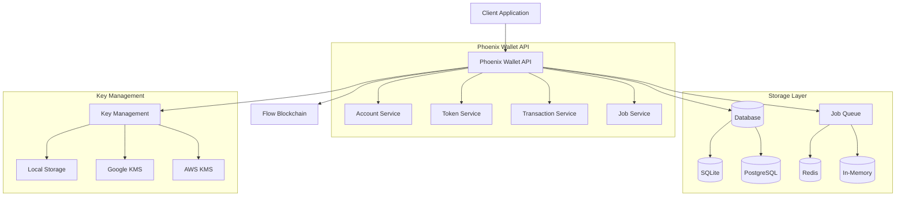

# Phoenix Wallet API for Flow

Welcome to **Phoenix Wallet API for Flow** - a community-revived, Cadence 1.0 compatible custodial wallet management solution for the Flow blockchain.

## 🔥 What is Phoenix Wallet API?

Phoenix Wallet API is a robust REST HTTP service that enables developers to integrate custodial wallet functionality into their Flow applications. Born from the ashes of the original Flow Wallet API, Phoenix provides essential wallet management capabilities with full Cadence 1.0 compatibility.

## 🎯 Problem We Solve

The original Flow Wallet API was a cornerstone for many developers building on Flow, offering essential custodial wallet management. Its discontinuation and subsequent incompatibility with Cadence 1.0 created a significant roadblock that:

- **Hindered ongoing development** for existing projects
- **Raised barriers to entry** for new developers  
- **Slowed broader adoption** of the Flow blockchain
- **Increased complexity** in managing user accounts and assets

Phoenix Wallet API directly addresses this critical gap by providing a reliable, maintained, and fully compatible solution.

## ✨ Key Features

### 🔗 **Full Cadence 1.0 Compatibility**
Seamlessly interact with the latest version of Flow blockchain and smart contracts.

### 👤 **Account Management**
- Create new Flow accounts
- Securely store and manage private keys
- Support for multiple key management systems (Local, Google KMS, AWS KMS)

### 💸 **Transaction Handling**
- Send transactions from managed accounts
- Improved nonce management for reliable processing
- Enhanced asynchronous transaction handling
- Built-in rate limiting and retry mechanisms

### 🪙 **Token Operations**
- Transfer fungible tokens (FLOW, FUSD, custom tokens)
- Automatic deposit detection and tracking
- Support for Non-Fungible Tokens (NFTs)
- Multi-token vault management

### 🛡️ **Security & Reliability**
- Idempotency support to prevent duplicate operations
- Encrypted key storage
- Comprehensive audit logging
- Production-ready security practices

### 🚀 **Flexible Deployment**
- **Standard Mode**: Full-featured with PostgreSQL + Redis
- **Lightweight Mode**: Simplified deployment with SQLite
- **Multi-Network Support**: Emulator, Testnet, Mainnet
- **Docker-ready**: Complete containerization support

## 🏗️ **Architecture Overview**



## 🎯 **Who Should Use Phoenix Wallet API?**

### **Perfect For:**
- **dApp Developers** building applications that need custodial wallet functionality
- **Exchanges & Marketplaces** handling user funds on Flow
- **Wallet Service Providers** requiring backend account infrastructure
- **Enterprise Teams** migrating to or building with Cadence 1.0

### **Use Cases:**
- **Hot Wallets** for cryptocurrency exchanges
- **Custodial Wallets** for web applications
- **Payment Processing** for e-commerce platforms
- **Asset Management** for gaming and NFT platforms

## 🚀 **Quick Start**

Get up and running in minutes:

```bash
# Clone the repository
git clone https://github.com/flow-hydraulics/flow-wallet-api.git
cd flow-wallet-api

# Start in lightweight mode (perfect for development)
make lightweight

# Your API is now running at http://localhost:3000/v1
# Documentation available at http://localhost:8081
```

## 🗺️ **What's Next?**

1. **[Getting Started](./getting-started/overview)** - Learn the basics and set up your first instance
2. **[Core Concepts](./concepts/architecture)** - Understand how Phoenix Wallet API works
3. **[Deployment Guides](./deployment/lightweight-mode)** - Deploy to your preferred environment
4. **[API Reference](./api-reference/overview)** - Explore all available endpoints

## 🌟 **Community & Support**

Phoenix Wallet API is a community-driven project. We welcome contributions, feedback, and collaboration:

- **GitHub**: [flow-hydraulics/flow-wallet-api](https://github.com/flow-hydraulics/flow-wallet-api)
- **Flow Discord**: Join the #dev-tools channel
- **Flow Forum**: [forum.onflow.org](https://forum.onflow.org)

---

Ready to build the future of Flow applications? Let's get started! 🚀